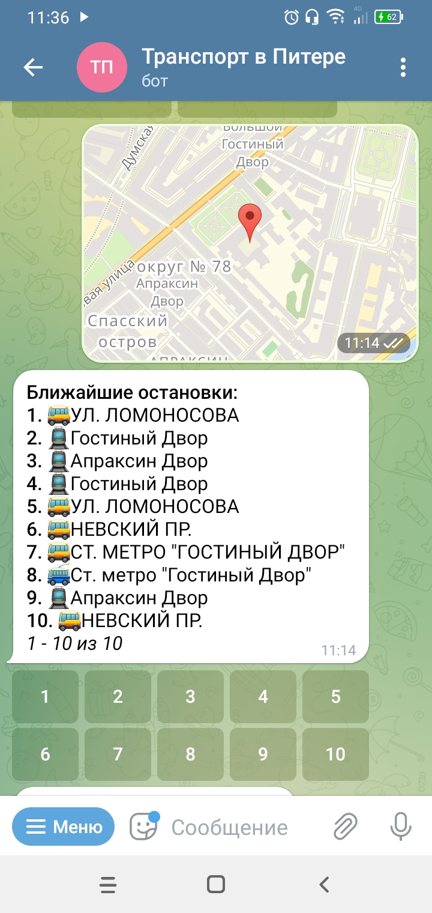
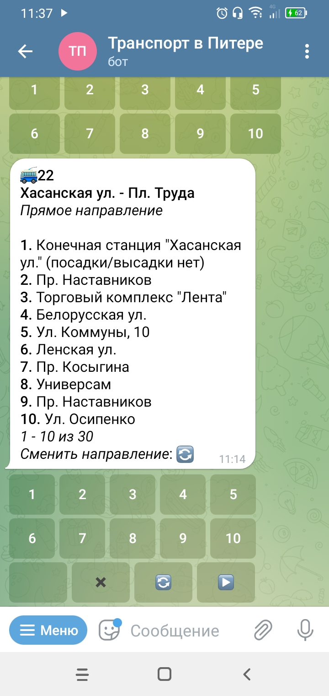
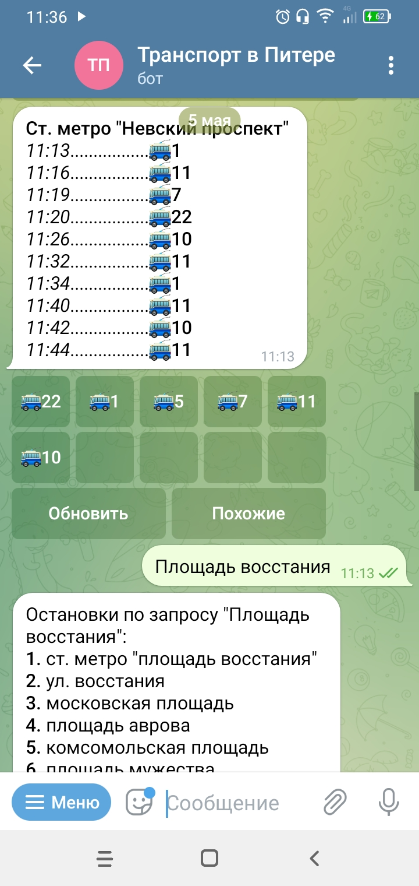

# @PiterBusBot

Телеграм бот, позволяющий смотреть прогноз прибытия транспорта в Питере в режиме реального времени.

Попробовать: 👉 [@PiterBusBot](https://t.me/PiterBusBot)

<div align="center">
	
	
	
</div>

## Установка
Должен быть установлен `python 3.7+`

```bash
git clone https://github.com/igorantonow314/transport_bot
cd transport_bot
make install
```

## Запуск
```bash
cd transport_bot
python __main__.py
```

Логи по-умолчанию записываются в `bot.log`.

## Источники и условия использования

_Данные о транспорте получены благодаря:_
 [Экосистеме городских сервисов «Цифровой Петербург»](https://petersburg.ru),
 [Порталу общественного транспорта
Санкт-Петербурга](https://transport.orgp.spb.ru)

Для использования необходимо прочитать [условия](https://transport.orgp.spb.ru/Portal/transport/userAgreementApi) и подать заявку. 
